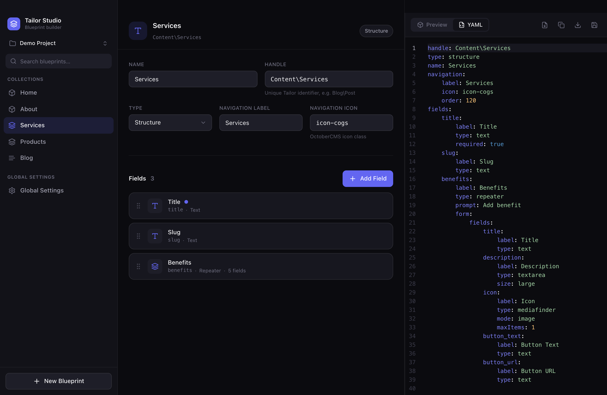
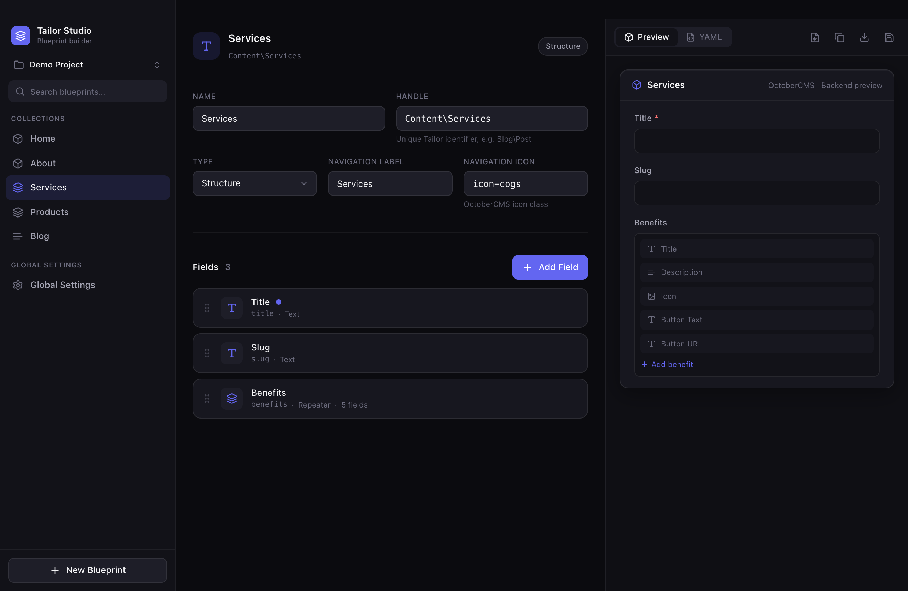
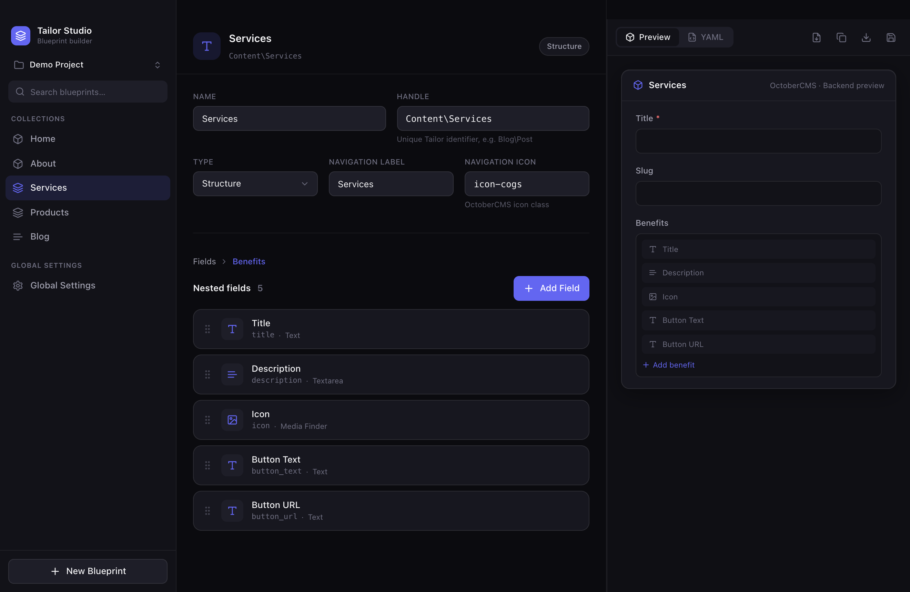

<div align="center">

# Tailor Studio

### A native macOS visual builder for OctoberCMS Tailor blueprints

Design your content schemas in a beautiful three-panel UI and export clean,
convention-following YAML — no hand-written blueprints, no admin-panel feel.

[Download for macOS](#download) · [Features](#features) · [How it works](#how-it-works) · [Architecture](#architecture)



</div>

> **Tailor only.** This is **not** a plugin builder — OctoberCMS already ships the
> Builder plugin for that. Tailor Studio focuses entirely on Tailor blueprints.

## Features

- 🎛 **Visual blueprint editor** — handle, name, type (Single / Structure / Stream / Global), navigation label & icon.
- 🧩 **17 field types** — Text, Textarea, Markdown, Rich Editor, Number, Date, Switch, Checkbox, Dropdown, Color Picker, Media Finder, File Upload, Code Editor, Repeater, Entries, Section, Partial.
- ↕️ **Drag & drop** field ordering.
- 🔁 **Repeater builder** — nested field editor with breadcrumb navigation and unlimited nesting.
- 🔗 **Entries relation builder** — source blueprint, relation type, display mode, max items.
- 📄 **Live YAML** — Monaco editor generates valid OctoberCMS Tailor YAML in real time; edit the YAML and it parses back into the UI.
- 👁 **Backend preview** — an approximate OctoberCMS backend form rendered from your fields.
- 🗂 **Multiple projects** — create, rename, duplicate and switch between projects; everything auto-saves locally.
- 📥 **Import / Copy / Export / Save** — round-trip existing blueprints and export project snapshots.
- 🌙 **Native macOS dark UI** — inspired by Raycast, Linear and Arc.

## Screenshots

| Visual editor | Repeater builder |
|---|---|
|  |  |

## Download

Grab the latest `.dmg` from the [**Releases**](../../releases/latest) page.

> The app is currently **unsigned** (no paid Apple Developer certificate yet). On
> first launch macOS Gatekeeper will warn you. To open it:
> **right-click the app → Open → Open**, or run
> `xattr -dr com.apple.quarantine "/Applications/Tailor Studio.app"`.

## Tech stack

- **Tauri 2** — native macOS shell (Rust)
- **Vue 3 + TypeScript** + **Vite**
- **Pinia** — state management
- **TailwindCSS** — dark, macOS-inspired styling
- **Monaco Editor** — live YAML view/edit
- **vuedraggable** — drag & drop field sorting

## Getting started

```bash
pnpm install

# Web preview (fast iteration, runs in the browser at :1420)
pnpm dev

# Native macOS app (Rust toolchain ≥ 1.88 required)
pnpm app:dev      # dev with hot reload
pnpm app:build    # production .app / .dmg

# Quality
pnpm typecheck
pnpm build        # type-check + Vite build
```

The app runs fully in the browser via `pnpm dev` (file dialogs fall back to
browser download / file-picker), so the desktop toolchain is optional during UI work.

## How it works

The three panels:

| Panel  | What it does |
|--------|--------------|
| **Left** | Project switcher, blueprint tree (Collections / Global Settings), search, `+ New Blueprint`. |
| **Center** | Blueprint editor — general settings + drag-sortable field list. Repeater fields open a nested editor with breadcrumb navigation. |
| **Right** | Tabbed **Preview** (backend form) and **YAML** (live, editable Monaco). Toolbar: Import · Copy · Export · Save. |

Every UI change updates the YAML in real time; editing the YAML re-parses back into the editor.

### Example output

```yaml
handle: Shop\Products
type: structure
name: Products
navigation:
    label: Products
    icon: icon-shopping-cart
fields:
    title:
        label: Title
        type: text
        required: true
    slug:
        label: Slug
        type: text
    image:
        label: Image
        type: mediafinder
        mode: image
```

## Architecture

The editor is **data-driven**: field types are declared once in a registry
([`src/data/fieldDefinitions.ts`](src/data/fieldDefinitions.ts)) that powers the
field picker, the inspector controls, creation defaults, the preview, and YAML
generation. Adding a field type is usually a single registry entry.

```
src/
  components/
    layout/     AppShell, RightPanel, Toast
    sidebar/    Sidebar, ProjectSwitcher, BlueprintTreeItem, NewBlueprintButton
    editor/     BlueprintEditor, GeneralSettings, FieldsSection, FieldCard, AddFieldMenu
    fields/     FieldInspector, OptionsEditor      (registry-driven controls)
    preview/    PreviewPanel, PreviewField         (faux backend form)
    yaml/       YamlPanel, MonacoEditor            (live YAML)
    ui/         Base* primitives + Icon
  stores/       projects (multi-project + persistence), blueprints, ui
  types/        Blueprint / Field / FieldDefinition models
  data/         fieldDefinitions (the registry), mockBlueprints (seed)
  generator/    yamlGenerator   model → Tailor YAML
  parser/       yamlParser      Tailor YAML → model
  composables/  useProjectIO (copy/import/export/save), useResizable
  utils/        id, handle slugging, entity factories
src-tauri/      Rust shell (dialog + fs plugins)
```

## Roadmap

- AI blueprint generation
- HTML → Tailor blueprint conversion
- Live connection to an OctoberCMS project
- Tailor diff viewer
- Dedicated global-settings builder
- Blueprint templates
- Full multi-file project persistence on disk (in-app multi-project + local autosave already shipped)

## License

MIT
